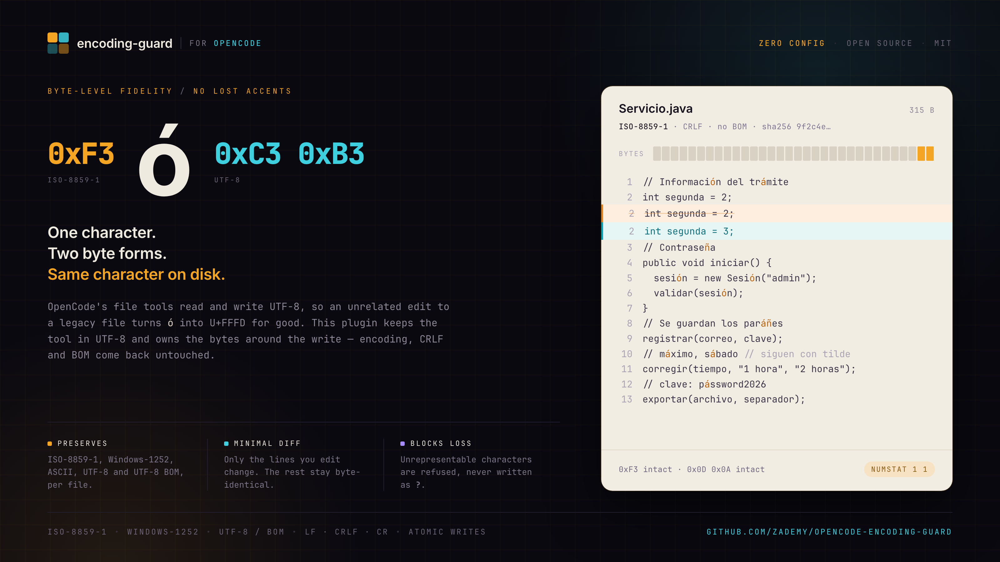

[](https://www.npmjs.com/package/opencode-encoding-guard)
[](LICENSE)
[](https://opencode.ai)

OpenCode's file tools read and write UTF-8. On a file that is not valid UTF-8 — a legacy Java
module in ISO-8859-1, an old JSP in Windows-1252 — **the read itself destroys the bytes**: `ó`
stored as the single byte `0xF3` is decoded as U+FFFD (`�`), and that byte is gone before any
encoding conversion could happen. Re-encoding afterwards cannot bring it back.

This plugin keeps the tool working in UTF-8 and owns the bytes around the write, so the file on
disk comes back byte-identical outside the lines you actually edited.

| | |
| --- | --- |
| **Encodings** | ISO-8859-1 · Windows-1252 · ASCII · UTF-8 · UTF-8 BOM — resolved per file |
| **Line endings** | LF · CRLF · CR preserved. Mixed files are reported, never normalised |
| **BOM** | never added, never removed |
| **Lossy writes** | blocked, naming the exact unrepresentable code point |
| **Writes** | atomic — temp file, `fsync`, rename |
| **Detection** | plugin rules → Eclipse `.settings` → `.editorconfig` → BOM → bytes → fallback |
| **Configuration** | none required. One dependency: `iconv-lite` |

---

## Install

```jsonc
// opencode.json
{
  "plugin": ["opencode-encoding-guard"]
}
```

Restart the service (`opencode service restart`). There is nothing else to configure: the plugin
enables itself and works out each file's encoding per operation.

<details>
<summary>Local development install</summary>

```bash
bun install
bun run build
```

Then add a shim to the global plugin directory — OpenCode discovers plugins there automatically,
while the `plugin` config key only resolves npm specifiers:

```ts
// ~/.config/opencode/plugins/encoding-guard.ts
export { default } from "/absolute/path/to/opencode-encoding-guard/dist/index.js";
```

The bundled `dist/index.js` is self-contained, so no dependency has to be installed in the config
directory. For a project-only install use `.opencode/plugins/` instead.

</details>

---

## The problem

```
Before (ISO-8859-1):  Informaci\xF3n del tr\xE1mite

Agent edits an unrelated line with OpenCode's own tools:

After (UTF-8):        Informaci\xEF\xBF\xBDn del tr\xEF\xBF\xBDmite     ← data lost
```

The damage is done at read time, so no encoder, charset setting or post-hoc `iconv` pass can undo
it. The only defence is to not hand the tool a file it cannot read.

## How it works

The guard owns the bytes on both sides of the tool call and keeps the tool itself inside UTF-8.

```
before ──▶ snapshot bytes + metadata ──▶ stage the file as exact UTF-8
                                             │
                                        the tool edits
                                             │
after  ──▶ decode what it wrote ──▶ restore encoding, line endings, BOM ──▶ atomic write
```

| Hook | Action |
| --- | --- |
| `execute.before` | Snapshot original bytes + metadata (encoding, BOM, line endings, sha256). Reject writes whose new text cannot be represented in the target encoding. For legacy files containing non-ASCII bytes, rewrite the file as **exact UTF-8** so the tool reads correct text. |
| `execute.after` | Decode what the tool wrote, restore the original encoding, line endings and BOM, write atomically, re-read and verify. If the tool changed nothing, put the snapshot back byte for byte so Git sees no diff. |

The result is a one-line diff on a file whose accents never moved:

```
$ file legacy/src/Servicio.java
legacy/src/Servicio.java: ISO-8859 text

$ git diff --numstat
1	1	legacy/src/Servicio.java
```

## Supported encodings

| Encoding | Notes |
| --- | --- |
| `iso-8859-1` | Latin-1, 1 byte per character |
| `windows-1252` | Distinct from Latin-1: smart quotes and `€` live in `0x80–0x9F` |
| `utf8` | Default |
| `ascii` | US-ASCII |

ISO-8859-1 and Windows-1252 are never conflated, and the plugin never converts between them. Files
with NUL bytes or UTF-16 BOMs are treated as binary and left alone.

## Encoding resolution

Deterministic configuration always wins over heuristics. Highest priority first:

1. Explicit plugin rule (`rules` in the config)
2. Eclipse `.settings/org.eclipse.core.resources.prefs` — file → deepest folder → project → default
3. `.editorconfig` `charset`
4. UTF-8 BOM
5. Byte analysis — ASCII / valid UTF-8 / `0x80–0x9F` present ⇒ Windows-1252 / otherwise ISO-8859-1
6. `fallbackEncoding` (default `utf8`)

Charsets that cannot be round-tripped safely (`Shift_JIS`, UTF-16, …) are **ignored, not guessed**.

### Eclipse

```properties
# .settings/org.eclipse.core.resources.prefs
eclipse.preferences.core.defaultEncoding=UTF-8
/Legacy=encode.ISO-8859-1
/Legacy/src/main/webapp=encode.windows-1252
/Legacy/src/main/webapp/legacy-note.txt=UTF-8
```

Both `encode.<charset>` and a bare charset value are accepted.

## Tools

Two read-only tools, so an agent can check a file before touching it.

`encoding_inspect` — single-file report:

```
File: legacy/src/Servicio.java

Encoding: ISO-8859-1

Source: Eclipse project preference

BOM: No

Line endings: CRLF

Round-trip: OK

Protection: Active
```

`encoding_scan` — project summary with a per-encoding histogram, mixed-encoding detection, Eclipse
detection and a list of at-risk files. Ignores `.git`, `node_modules`, `target`, `build`, `dist`
and `out` by default.

## Configuration

Defaults work with no configuration at all. Create `.encoding-guard.json` in the project root to
change them — options passed by OpenCode are merged on top of the file:

```jsonc
{
  "enabled": true,
  "mode": "preserve",              // preserve | warn
  "fallbackEncoding": "utf8",
  "newFileEncoding": "inherit",    // inherit = rule → Eclipse → .editorconfig → fallback
  "preserveLineEndings": true,
  "preserveBom": true,
  "unsupportedCharacters": "block", // block | warn | allow-lossy
  "eclipse": { "enabled": true },
  "editorconfig": { "enabled": true },
  "maxFileBytes": 8388608,
  "debug": false,
  "ignore": [".git", "node_modules", "target", "build", "dist", "out"],
  "rules": [
    { "glob": "legacy/**/*.java", "encoding": "iso-8859-1" }
  ]
}
```

A malformed config file never breaks the plugin; it is ignored and the defaults are used.

## Unrepresentable characters

The default policy is `block`. The agent gets a precise, actionable error and **the working tree is
left untouched** — the check runs before anything is staged or written:

```
Encoding Guard blocked an unsafe write.

File:
legacy/src/Servicio.java

Original encoding:
ISO-8859-1

Unsupported character:
U+2705 ✅

No file corruption was allowed.

Use a representable alternative ... or migrate the file encoding explicitly.
```

## Safety and failure policy

- **Fail closed.** If safe re-encoding cannot be guaranteed, the original bytes are restored and the
  failure is logged. The plugin prefers blocking over corrupting source.
- **Path safety.** Patch paths are resolved against the project root and rejected if they escape it
  (`../../../etc/passwd`). Windows separators and drive letters are handled.
- **Atomic writes.** Content is written to a sibling temp file, flushed, then renamed over the target.
- **Operation-scoped state.** Metadata lives in a registry keyed by `Tool.CallID`, never in a single
  global variable, so concurrent operations cannot restore each other's snapshots.
- **Binary files** (NUL bytes, UTF-16) are never touched.
- **Oversized files** above `maxFileBytes` are skipped with a warning instead of being buffered.

## Interaction with context-mode

Fully independent. This plugin only owns the filesystem encoding boundary; `context-mode` owns
context management, compaction and retrieval. Neither indexes, compacts or rewrites the other's
state, and both can be enabled at the same time.

## Known limitations

- If the OpenCode process is killed between `before` and `after`, a staged file stays UTF-8 until the
  next edit of that file restores it. The window is one tool call.
- Files above `maxFileBytes` are not protected.
- Statistical encoding detection is not implemented; legacy files with no configuration rely on byte
  analysis, which cannot distinguish two single-byte encodings that differ outside `0x80–0x9F`.
- Mixed line-ending files are reported and left alone rather than normalised.
- Only the `edit`, `write`, `patch` / `apply_patch` and `multiedit` tools are intercepted. Direct
  writes by shell commands (`sed -i`, build tools) are outside the plugin's reach.

## Development

```bash
bun install
bun run check     # typecheck + tests — the gate
bun run build     # dist/index.js + types
```

The encoding core under `src/core/` does not import the OpenCode SDK and is testable on its own.

## Contributing

Issues and pull requests are welcome. For any encoding bug, please include the byte-level evidence
(`xxd` / `file` output, `git diff --numstat`) — that is what the test suite asserts on, and text
that merely looks right proves nothing.

## License

MIT
